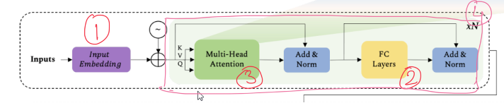

 
<h1 align="center">Session 12: The Dawn of Transformers
 

<!-- toc -->
 
    

     

### Problem Statement
Goal is to understand and explain Visual Transformers Block

#### Block 
- Code Section : Line 171-227
- This Class defines the wrapper for the multihead attention and tranformations which constitues the building blocks of Transformer Encoders.
- The class also wraps the layer normalisation and FC layers
- It's highlighted in circled 4 in the diagram

#### Embeddings
- Code Section : Line 124-168
- This class defines the Learninable Positional Embeddings & Path Embeddings via Resenetv2 or a Conv2d
- It also includes the class token initialisation for Patch Embedding & Positional Embeddings using the nn.Parameter so that they are learned during the training.
- It's highlighted in circled 1 in the diagram

#### MLP
- Code Section : Line 99-121
- This defines the MLP layers which is used to train the CLS token during pretraining and fine tuning.
- It has 2 FC layers , GELU as the activation and dropout for each FC layer
- Xavier Uniform initialisation is used for the layers.
- It's highlighted in circled 2 in the diagram

#### Attention
- Code Section : Line 52-96
- This Class wraps the multi-head attention code
- It takes the number of heads from config
- it defines the Query,Key & Value transformation layers
- Computes the Attention matrix from Key & Query matrices
- Finally it computes the context layers using the values and attention matrix
- - It's highlighted in circled 3 in the diagram

#### Encoder
- Code Section : Line 230-247
- This class defines the Encoder Architecture for our model. This stacks multiple blocks that we defined.
- This act as the whole wrapper for our ViT model.
- The diagram shows a Encoder with only 1 Block. We can have multiple such blocks(circled in 4)

#### Diagram

