 
<h1 align="center">Session 8: Advanced training Concepts
 
<!-- toc -->
     
    

     

### Contributors

 <b>Team - 6</b> 

    
| <centre>Name</centre> | <centre>Mail id</centre> | 
| ------------ | ------------- |
| <centre>Amit Agarwal</centre>         | <centre>amit.pinaki@gmail.com</centre>    |
| <centre>Pranav Panday</centre>         | <centre>pranavpandey2511@gmail.com</centre>    |
| <centre>Rajamannar A K</centre>         | <centre>rajamannaraanjaram@gmail.com</centre>    |
| <centre>Sree Latha Chopparapu</centre>         | <centre>sreelathaemail@gmail.com</centre>    |\\

<!-- toc -->
    
## Problem Statement

Write a custom ResNet architecture for CIFAR10 that has the following architecture:
 - PrepLayer - Conv 3x3 s1, p1) >> BN >> RELU [64k]
 - Layer1 -
    - X = Conv 3x3 (s1, p1) >> MaxPool2D >> BN >> RELU [128k]
    - R1 = ResBlock( (Conv-BN-ReLU-Conv-BN-ReLU))(X) [128k] 
    - Add(X, R1)
- Layer 2 -
    - Conv 3x3 [256k]
    - MaxPooling2D
    - BN
    - ReLU
- Layer 3 -
    - X = Conv 3x3 (s1, p1) >> MaxPool2D >> BN >> RELU [512k]
    - R2 = ResBlock( (Conv-BN-ReLU-Conv-BN-ReLU))(X) [512k]
    - Add(X, R2)
- MaxPooling with Kernel Size 4
- FC Layer 
- SoftMax
- Uses One Cycle Policy such that:
    - Total Epochs = 24
    - Max at Epoch = 5
    - LRMIN = FIND
    - LRMAX = FIND
    - NO Annihilation
- Uses this transform -RandomCrop 32, 32 (after padding of 4) >> FlipLR >> Followed by - CutOut(8, 8)
- Batch size = 512
- Target Accuracy: 90% (93% for late submission or double scores). 
- NO score if your code is not modular. Your collab must be importing your GitHub package, and then just running the model. I should be able to find the custom_resnet.py model in your GitHub repo that you'd be training. 

## Model training log

## Plots
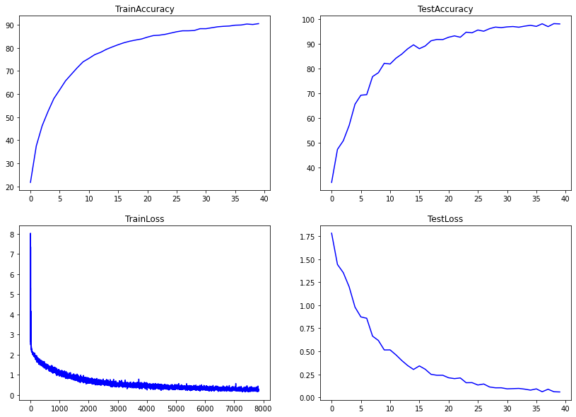

## Misclassifications

Below are examples of some missclassified examples in the test set.  

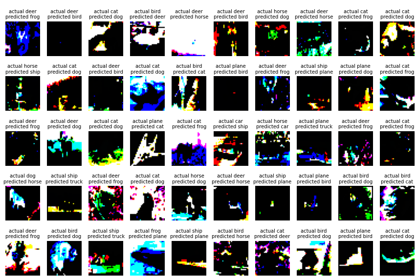

## Grad-CAM outputs

Below are 10 grad-cam example images for misclasified examples in the test set.  

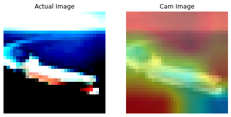
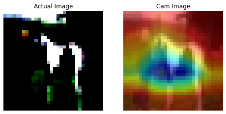
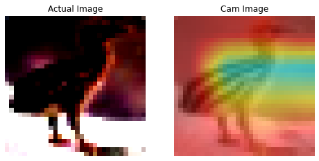
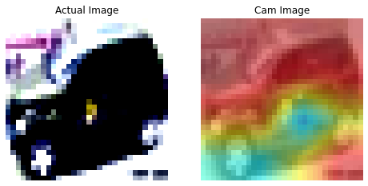
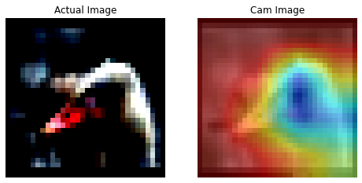
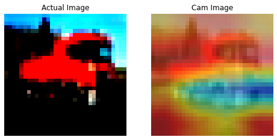
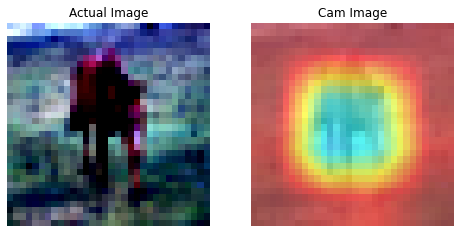
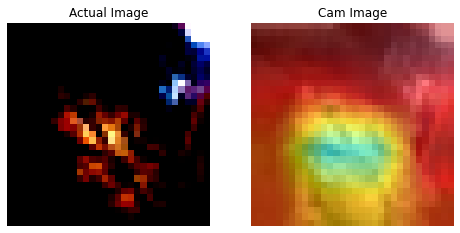
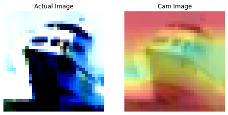
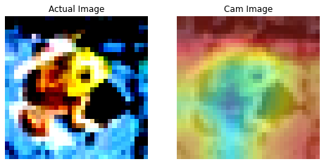